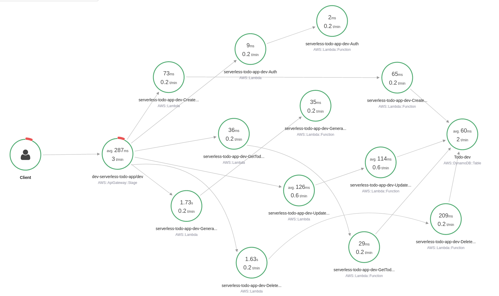

# Serverless Todo application

This application will allow creating/removing/updating/fetching TODO items. Each TODO item can optionally have an attachment image. Each user only has access to TODO items that he/she has created.

This project demonstrates the usage of:
- serverless framework
- serverless offline 
- AWS lambda architecture
- API Gateway REST-API and validations
- Authentication and authorization with Auth0
- DynamoDB integration
- S3 signedUrl Upload
- AWS X-Ray
- Ports and Adapter Architecture (separation of business and data layer)

# How to run the application

## Backend

### Deployment
To deploy an application run the following commands:

```
cd backend
npm install
sls deploy -v
```

### Run local version
```
cd backend
npm install
sls dynamodb install
sls offline start
```

## Frontend

To run a client application first edit the `client/src/config.ts` file to set correct parameters. 
The current application endpoint is already set in the config:  
`https://0f1asjki5e.execute-api.eu-central-1.amazonaws.com/dev`
And then run the following commands:

```
cd client
npm install
npm run start
```

This should start a development server with the React application that will interact with the serverless TODO application.

## AWS X-Ray
